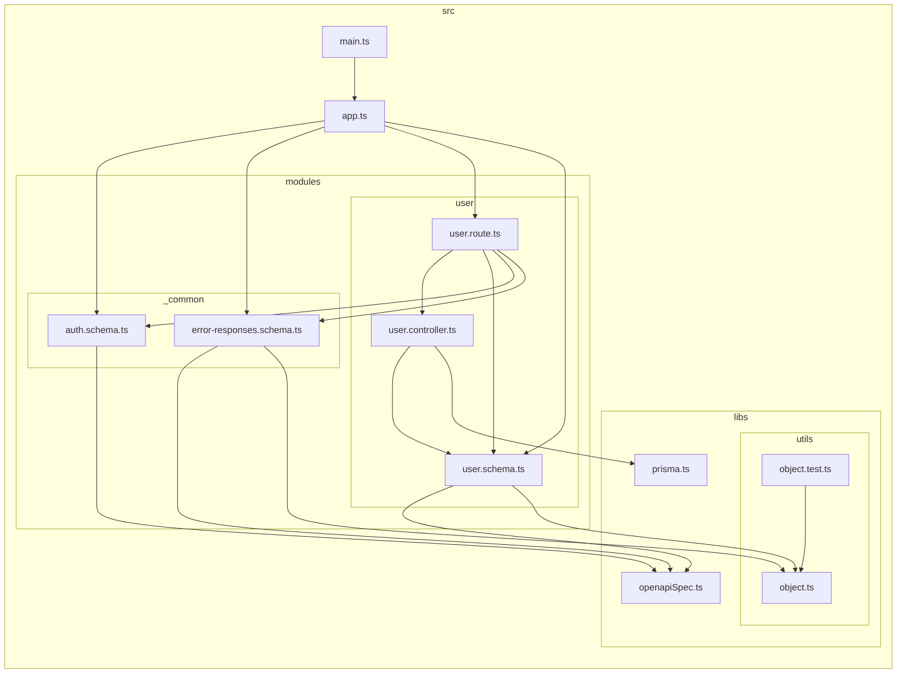

```mermaid
flowchart LR

subgraph 0["src"]
1["app.ts"]
subgraph 2["modules"]
subgraph 3["_common"]
4["auth.schema.ts"]
7["error-responses.schema.ts"]
end
subgraph A["user"]
B["user.route.ts"]
C["user.controller.ts"]
D["user.schema.ts"]
end
end
subgraph 5["libs"]
6["openapiSpec.ts"]
subgraph 8["utils"]
9["object.ts"]
F["object.test.ts"]
end
E["prisma.ts"]
end
G["main.ts"]
end
1-->4
1-->7
1-->B
1-->D
4-->6
7-->6
7-->9
B-->C
B-->D
B-->4
B-->7
C-->D
C-->E
D-->6
D-->9
F-->9
G-->1
```
