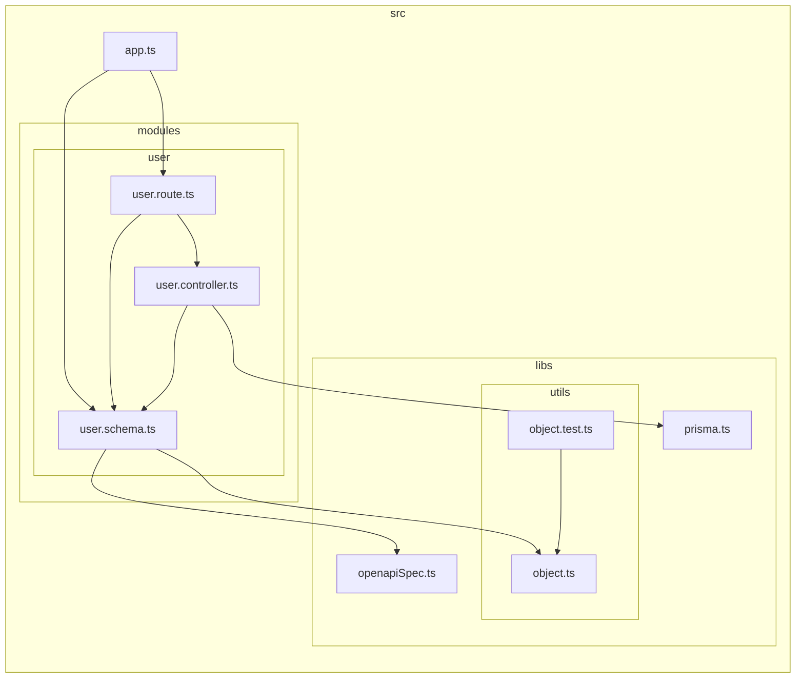

```mermaid
flowchart LR

subgraph 0["src"]
1["app.ts"]
subgraph 2["modules"]
subgraph 3["user"]
4["user.route.ts"]
5["user.controller.ts"]
6["user.schema.ts"]
end
end
subgraph 7["libs"]
8["openapiSpec.ts"]
subgraph 9["utils"]
A["object.ts"]
C["object.test.ts"]
end
B["prisma.ts"]
end
end
1-->4
1-->6
4-->5
4-->6
5-->6
5-->B
6-->8
6-->A
C-->A
```
