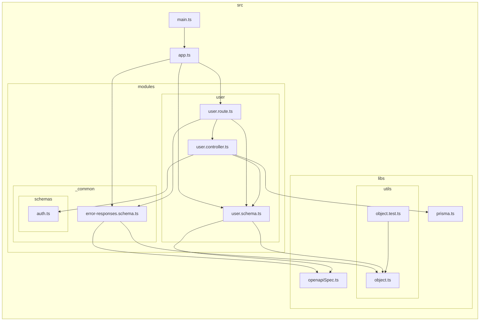

```mermaid
flowchart LR

subgraph 0["src"]
1["app.ts"]
subgraph 2["modules"]
subgraph 3["_common"]
4["error-responses.schema.ts"]
subgraph E["schemas"]
F["auth.ts"]
end
end
subgraph 9["user"]
A["user.route.ts"]
B["user.controller.ts"]
C["user.schema.ts"]
end
end
subgraph 5["libs"]
6["openapiSpec.ts"]
subgraph 7["utils"]
8["object.ts"]
G["object.test.ts"]
end
D["prisma.ts"]
end
H["main.ts"]
end
1-->4
1-->A
1-->C
4-->6
4-->8
A-->B
A-->C
A-->4
B-->C
B-->D
B-->F
C-->6
C-->8
G-->8
H-->1
```
